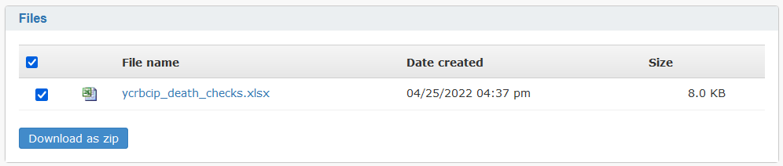

# LASER Biscom: A Secure File Transfer guide

This guide is to help staff working on the Yorkshire Cancer Research Bowel Cancer Improvement Programme (YCRBCIP) transfer files to and from the University of Leeds secure IT platform, called LASER. Files can be transferred to and from LASER using our Secure File Transfer service, called LASER Biscom.

If you need any help using Biscom, you can email the LIDA Data Analytics Team (DAT) for support at [dat@leeds.ac.uk](mailto:dat@leeds.ac.uk).

- [Sending files](#sending-files)
- [Receiving files](#receiving-files)
- [Help](#help)

## Sending files

Please do not email files directly to project team or LASER staff.

1. If you're accessing LASER Biscom for the first time:
    1. You should get an email from lasersft@leeds.ac.uk: 
     
    1. Click the link in this email and you'll be taken to Biscom's registration page: 
     
    1. Fill in the registration form, accept the terms of service and click the Register button
    1. Now that you're registered, Biscom will ask you to sign in: 
     
    1. Sign in using the email address and password you created when you registered
1. If you've already registered with LASER Biscom:
    1. Sign into Biscom by opening a web browser and going to [https://laser-sft.leeds.ac.uk/sft](https://laser-sft.leeds.ac.uk/sft)
    1. Or you can find the original email you received from lasersft@leeds.ac.uk and click the link in the email
    1. Sign in using the email address and password for your Biscom account
1. Tip: To make it easier to sign in, you may want to bookmark [https://laser-sft.leeds.ac.uk/sft](https://laser-sft.leeds.ac.uk/sft) in your web browser so that next time you need to sign in you only have to click your bookmark for Biscom
1. Now that you're signed in you can view your Biscom inbox: 
 
1. Your Biscom inbox should include a secure message from the LIDA Data Analytics Team (DAT) with a subject title similar to "Import YCRBCIP files to LASER"
1. Open this secure message and scroll down to find the Reply section
1. You can transfer files to LASER by replying to this secure message with your files attached: 
 
1. Attach the files you need to send and write a brief message describing what the files contain
1. The file upload progress can be seen in the bottom left of the screen
1. Anything written into the secure message box will only be visible from within Biscom
1. Once your files have uploaded, click the "Send reply" button to transfer the files to LASER

## Receiving files

1. The YCRBCIP project team may email you to let you know to expect files from LASER
1. The LIDA Data Analytics Team (DAT) will send you files using LASER Biscom
1. When DAT send you files, you will get a notification email from lasersft@leeds.ac.uk
1. Click the link in the notification email and log into Biscom to view the secure message containing files for you to download
1. Alternatively, you can go to https://laser-sft.leeds.ac.uk/sft in a web browser and log into Biscom to reach your Biscom inbox, where you'll find an unread message containing the files
1. The secure message will contain a Files section, where you can find the files ready for you to download:
 
1. To download all files, select the checkbox above the file list, like shown in the above example, then click the "Download as zip" button
1. A ZIP file containing all the files in the secure message will be downloaded to your computer

## Help

1. I can't access LASER Biscom. The web page shows "Request blocked error".
    1. Make sure you use HTTPS not HTTP, i.e. https://laser-sft.leeds.ac.uk/sft
    1. Try going to https://laser-sft.leeds.ac.uk/sft in a private/incognito browser window. If this works you'll need to clear browsing history to access Biscom in a regular browser window.
1. My password isn't working.
    1. Reset your password by going to https://laser-sft.leeds.ac.uk/sft
    1. Click the "Forgot your password?" link, below the Sign in button
    1. On the next page, enter your email address and click Submit
    1. If you can't remember your email address, contact [dat@leeds.ac.uk](mailto:dat@leeds.ac.uk)
    1. Once you've provided your email address, you will receive an email address with further instructions
